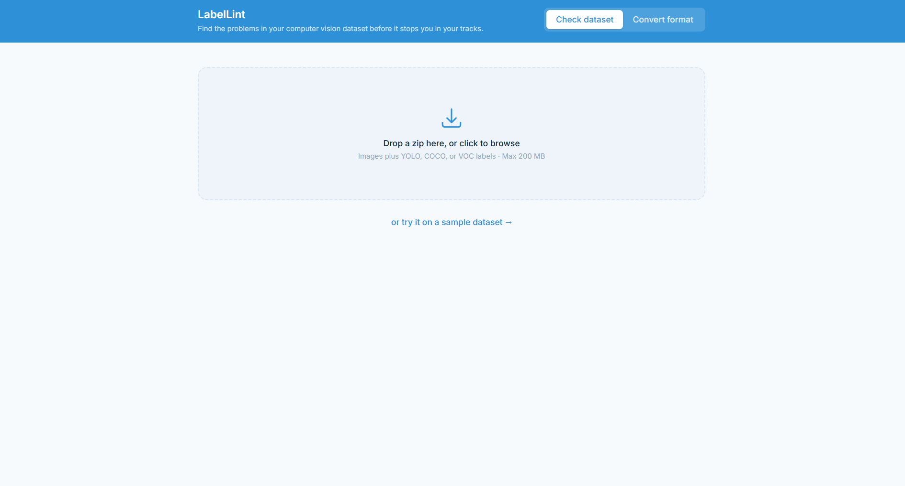
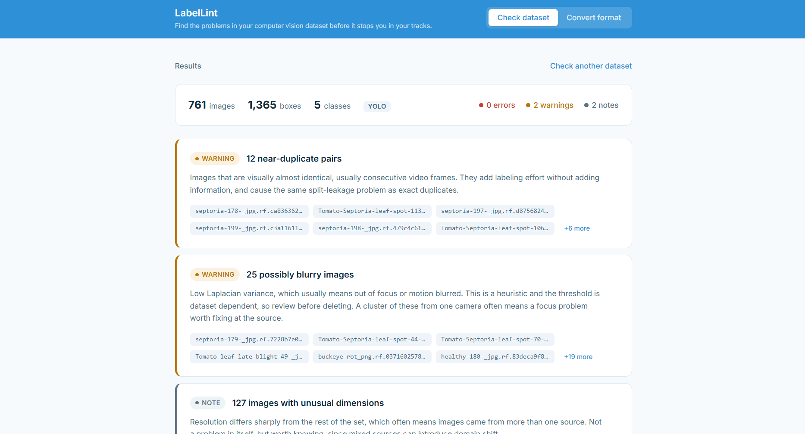
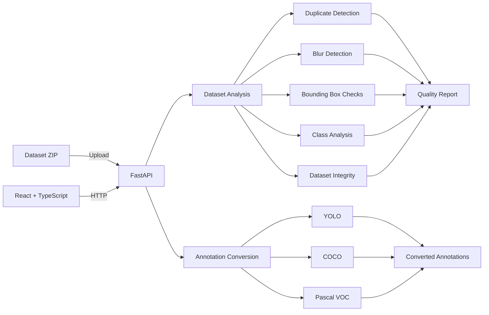

# LabelLint

Find the problems in your computer vision dataset before it stops you in your tracks.

**Live demo:** https://labellint.vercel.app

| Check Dataset (No file)             | Check Dataset (Demo File)          |
| ----------------------------------- | ----------------------------------- |
|  |  |

---

## Why I built this

Every CV project I have worked on, the bottleneck was never the model because it was the dataset created to train the model. Duplicate frames that inflate your validation score. A rare defect class with eleven examples that the model just learns to ignore. A box with basically zero area because someone's mouse slipped during labeling. None of it shows up until you have already trained something and are sitting there wondering why it does not work.

I built this tool so I know what I had run first. Upload a dataset, get a report on what is actually wrong with it, fix it before you spend a day training on bad data.

## What it does

Upload a zip with images and YOLO, COCO, or Pascal VOC labels. It checks for:

* Exact duplicate images
* Near duplicate images (usually consecutive video frames)
* Blurry images
* Degenerate boxes (zero or near zero area)
* Boxes that extend past the image edge
* Boxes that are too small to realistically train on
* Extreme aspect ratio boxes (usually a labeling mistake)
* Class imbalance
* Unlabeled images and orphaned label files

It also converts annotations between YOLO, COCO, and Pascal VOC.

## Why there is no ML model anywhere in this project

Every check is deterministic. Perceptual hashing for duplicates, Laplacian variance for blur, plain arithmetic for box geometry and class counts. I did this on purpose. A check that can be wrong because a model got something wrong is worse than a check that is always right because there is no model involved. 

## Stack

Backend: FastAPI, Pillow, OpenCV, imagehash, NumPy
Frontend: React, TypeScript, Vite, Tailwind CSS

---

## Architecture



## Running it locally

Backend:

```bash
cd backend
python -m venv venv
source venv/bin/activate   (Windows: .\venv\Scripts\Activate.ps1)
pip install -r requirements.txt
uvicorn app.main:app --reload
```

Frontend, second terminal:

```bash
cd frontend
npm install
npm run dev
```

Open localhost:5173. Click "try it on a sample dataset" if you do not have your own zip handy.

## Decisions worth explaining

**No database.** Upload, process, show results, done. Nothing exists past the session. I was unsure on this, but I kept coming back to the fact that someone checking a dataset wants an answer, not have to create an account.

**Background jobs, in memory.** Processing a few hundred images takes 10 to 30 seconds, too long to hold an HTTP request open for. Upload returns a job id right away, the frontend polls for status. Job state lives in a plain Python dict.

**Duplicate detection is O(n squared).** At my 2000 image cap that is a few seconds of comparisons in Python. Fine at this scale. If I raised the limit I would bucket by hash prefix first instead of comparing everything to everything.

**Blur detection uses both a fixed threshold and a percentile cutoff**, not just one or the other. A single fixed number does not generalize across datasets that are naturally softer or sharper to begin with. Flagging the bottom decile relative to the rest of the set catches genuine outliers without flagging an entire dataset that just happens to be a little soft.

**COCO category ids get remapped.** COCO category ids are not required to be contiguous or zero indexed, the real COCO dataset skips numbers. Assume category_id equals class index and you get silently wrong labels. I remap to a clean 0 based index internally and convert back on export.

**Conversion only returns annotations, not images.** You already have your images.

**Zip extraction blocks path traversal.** A malicious zip can contain a file path like ../../etc/passwd, and extracting it naively writes outside the folder you meant to extract into. Every path gets checked before it is written.

## What I would build next

**Downtime style categorization for defect classes.** Right now if you are checking a defect dataset the classes are just whatever the labeler typed. Grouping into categories the way I did with downtime reasons on my other project would make the class imbalance finding a lot more actionable.

**Real mislabel detection.** Run embeddings (CLIP or similar) on every image, cluster them, flag anything whose label disagrees with what its neighbors look like. 

**Bigger datasets.** Right now everything is capped low enough to run comfortably on a single small server. Scaling past that means moving off the in memory job store and probably off in memory duplicate detection too.


## License

MIT

